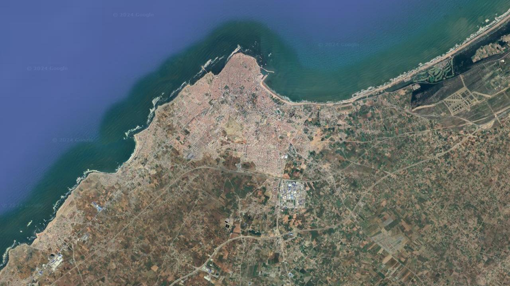

# Satellite Imagery Generator API

This is a FastAPI application that generates high-resolution Satellite images given a latitude, longitude, and zoom level.

## Features

- Generates high-resolution Satellite images by stitching together multiple map tiles.
- Allows users to specify the latitude, longitude, and zoom level to customize the map view.
- Returns the generated map image as a PNG file.

## Requirements

- Python 3.7+
- FastAPI
- Uvicorn
- Pillow

## Installation

1. Clone the repository:
    ```bash
    git clone https://github.com/Ay0ubN0uri/satellite-imagery-downloader.git
    cd satellite-imagery-downloader
    ```

2. Create and activate a virtual environment (optional but recommended):
    ```bash
    python -m venv venv
    source venv/bin/activate   # On Windows, use `venv\Scripts\activate`
    ```

3. Install the required packages:
    ```bash
    pip install -r requirements.txt
    ```

## Running the Application

1. Start the FastAPI application using Uvicorn:
    ```bash
    python app.py
    ```

2. Access the application in your web browser at `http://127.0.0.1:8000`.

## API Endpoint

### GET /imagery

Generates and returns a high-resolution satellite image based on the specified coordinates and zoom level.

#### Query Parameters:

- `lat` (float): The latitude of the location.
- `lng` (float): The longitude of the location.
- `zoom` (int, optional): The zoom level of the map (default is 12, range is 0-23).

#### Example Request:
```http
# City El jadida
http://127.0.0.1:8000/map?lat=32.64744148514956&lng=-5.923164816419615&zoom=13
```


#### Example Response:




